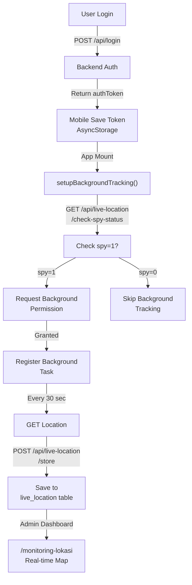

# ✅ LIVE LOCATION MOBILE - IMPLEMENTASI SELESAI

## Status Implementasi

### ✅ Mobile (React Native/Expo)
- [x] Dependencies installed: `expo-background-fetch`, `expo-task-manager`, `@react-native-async-storage/async-storage`
- [x] app.json updated dengan permissions (Android & iOS)
- [x] backgroundLocation.ts created dan siap pakai
- [x] webview.tsx updated dengan background tracking logic
  - setupBackgroundTracking() function
  - handleLogout() function
  - Updated handleMessage() untuk USER_LOGIN/LOGOUT
  - Debug button di development mode

### ✅ Backend (Laravel)
- [x] checkSpyStatus() method di LiveLocationController
- [x] Route `/api/live-location/check-spy-status` ditambahkan
- [x] API endpoint untuk check spy status done

---

## 🚀 Testing & Build Instructions

### 1. Testing di Development Environment

**Test pada device/emulator:**
```bash
cd d:\APLIKASI PROJECT\smatt3\smattendance-mobile

# Jalankan development build
expo run:android

# Atau untuk iOS
expo run:ios
```

**Test login flow:**
1. Login dengan akun yang punya `spy=1`
2. Check console logs untuk melihat:
   ```
   🔍 Checking spy status for background tracking...
   ✅ User has spy=1, setting up background tracking
   ```
3. Minimize app → background tracking should continue
4. Check database: lokasi harus terus ter-update setiap 30 detik

### 2. Debug Tracking Status (Development Only)

Ketika app dalam development mode (`__DEV__`), ada debug button (bug icon) di layar:
- Tap debug button untuk lihat:
  - Task Registered: `true/false`
  - User NIK
  - Foreground Permission status
  - Background Permission status

### 3. Build APK untuk Production

```bash
# Build signed APK
eas build --platform android --release

# Atau build directly dengan gradle
cd android
./gradlew assembleRelease
```

---

## 📱 Workflow Saat Ini



---

## 🔧 Konfigurasi

### Interval Tracking
File: `smattendance-mobile/utils/backgroundLocation.ts` line 7
```typescript
const TRACKING_INTERVAL = 30000; // milliseconds
// Ubah nilai untuk custom interval:
// 10000 = 10 detik (akurat, boros battery)
// 30000 = 30 detik (balance - default)
// 60000 = 1 menit (hemat battery)
```

### API URL
File: `smattendance-mobile/utils/backgroundLocation.ts` line 8
```typescript
const API_BASE_URL = 'https://smattendancev2.amnal.site';
// Ubah ke URL backend Anda
```

### Web URL di WebView
File: `smattendance-mobile/app/webview.tsx` line 25
```typescript
const webUrl = 'https://smattendancev2.amnal.site/';
// Ubah sesuai kebutuhan
```

---

## 🧪 Testing Checklist

- [ ] Development build jalan tanpa error
- [ ] Login dengan akun spy=1
- [ ] Console log menunjukkan "User has spy=1, setting up background tracking"
- [ ] Debug button menunjukkan Task Registered: true
- [ ] Minimize app → check database, lokasi terus ter-update
- [ ] Login dengan akun non-spy → background tracking tidak aktif
- [ ] Logout → background task berhenti
- [ ] Build APK release
- [ ] Test APK pada real Android device
- [ ] Monitor `/monitoring-lokasi` dashboard saat karyawan spy aktif

---

## 📊 API Endpoints

### 1. Check Spy Status
```
GET /api/live-location/check-spy-status
Headers: Authorization: Bearer {token}

Response 200:
{
  "status": true,
  "nik": "001.001.0001",
  "name": "John Doe",
  "spy": 1,
  "message": "Live location monitoring enabled"
}

Response 404:
{
  "status": false,
  "message": "Data karyawan tidak ditemukan"
}
```

### 2. Store Location
```
POST /api/live-location/store
Headers: Authorization: Bearer {token}
Body:
{
  "nik": "001.001.0001",
  "latitude": -6.3157,
  "longitude": 106.8227,
  "accuracy": 15.5,
  "tracked_at": "2026-04-23T10:30:45Z"
}

Response 200:
{
  "status": true,
  "message": "Lokasi berhasil dicatat",
  "data": {
    "id": 1,
    "nik": "001.001.0001",
    "latitude": -6.3157,
    "longitude": 106.8227,
    "accuracy": 15.5,
    "lokasi": "Jakarta, Indonesia",
    "tracked_at": "2026-04-23T10:30:45Z"
  }
}
```

### 3. Get Latest Location
```
GET /api/live-location/{nik}/latest
Response 200:
{
  "status": true,
  "data": {
    "id": 100,
    "nik": "001.001.0001",
    "latitude": -6.3157,
    "longitude": 106.8227,
    "accuracy": 15.5,
    "lokasi": "Jakarta, Indonesia",
    "tracked_at": "2026-04-23T10:30:45Z"
  }
}
```

### 4. Get All Spy Locations (untuk admin dashboard)
```
GET /api/live-location/all/spy-locations
Response 200:
{
  "status": true,
  "count": 5,
  "data": [
    {
      "nik": "001.001.0001",
      "nama_karyawan": "John Doe",
      "spy": 1,
      "latestLiveLocation": {
        "latitude": -6.3157,
        "longitude": 106.8227,
        "tracked_at": "2026-04-23T10:30:45Z"
      },
      "jabatan": { "nama_jabatan": "Manager" },
      "departemen": { "nama_departemen": "IT" },
      "cabang": { "nama_cabang": "Jakarta Pusat" }
    }
  ]
}
```

---

## 🐛 Troubleshooting

### Background Task Tidak Berjalan

**Symptom:** Lokasi tidak ter-update saat app di-background

**Solutions:**
1. Check Android settings:
   - Settings → Apps → PresensiMobile → Permissions → Location → Always allow
   - Settings → Apps → PresensiMobile → Battery → Not optimized

2. Check task registration:
   - Tap debug button di app
   - Verify "Task Registered: true"

3. Check logcat:
   ```bash
   adb logcat | grep -i "background\|location\|expo"
   ```

4. Verify backend auth token:
   - Token harus valid dan tidak expired
   - Check API response code: 401 = token invalid, 403 = spy tidak aktif

### High Battery Drain

**Solutions:**
1. Increase tracking interval:
   ```typescript
   const TRACKING_INTERVAL = 60000; // 1 minute
   ```

2. Change accuracy setting:
   ```typescript
   accuracy: Location.Accuracy.Balanced // Instead of High
   ```

3. Disable background tracking saat battery low:
   - Implement in backgroundLocation.ts

### Permission Denied

**Solutions:**
1. Request foreground permission DULU sebelum background
2. iOS: Check NSLocationAlwaysAndWhenInUseUsageDescription di Info.plist
3. Android 11+: Need explicit background location permission request
4. Manually grant permission:
   - Settings → Apps → PresensiMobile → Permissions → Location

---

## 📚 File References

| File | Purpose |
|------|---------|
| `smattendance-mobile/package.json` | Dependencies |
| `smattendance-mobile/app.json` | Permissions & config |
| `smattendance-mobile/utils/backgroundLocation.ts` | Background service |
| `smattendance-mobile/app/webview.tsx` | Main app component |
| `app/Http/Controllers/Api/LiveLocationController.php` | Backend controller |
| `routes/api.php` | API routes |

---

## 🎯 Next Steps

1. **Build APK:** `eas build --platform android --release`
2. **Test on Device:** Install APK dan test dengan akun spy=1
3. **Monitor Dashboard:** Check `/monitoring-lokasi` untuk real-time tracking
4. **Optimize Battery:** Adjust tracking interval sesuai kebutuhan
5. **Deploy to Production:** Publish APK ke app store/firebase

---

## 📞 Support

Jika ada issues:
1. Check console logs (development build)
2. Check Android logcat: `adb logcat`
3. Verify API responses dengan tools seperti Postman
4. Check database: tabel `live_location` untuk verify data masuk
5. Review file: `docs/MONITORING_LOKASI_TROUBLESHOOTING.md`

